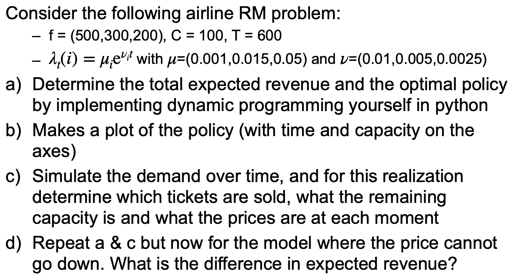
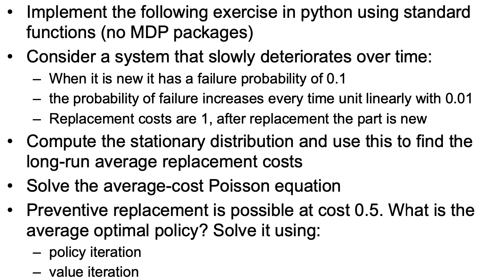
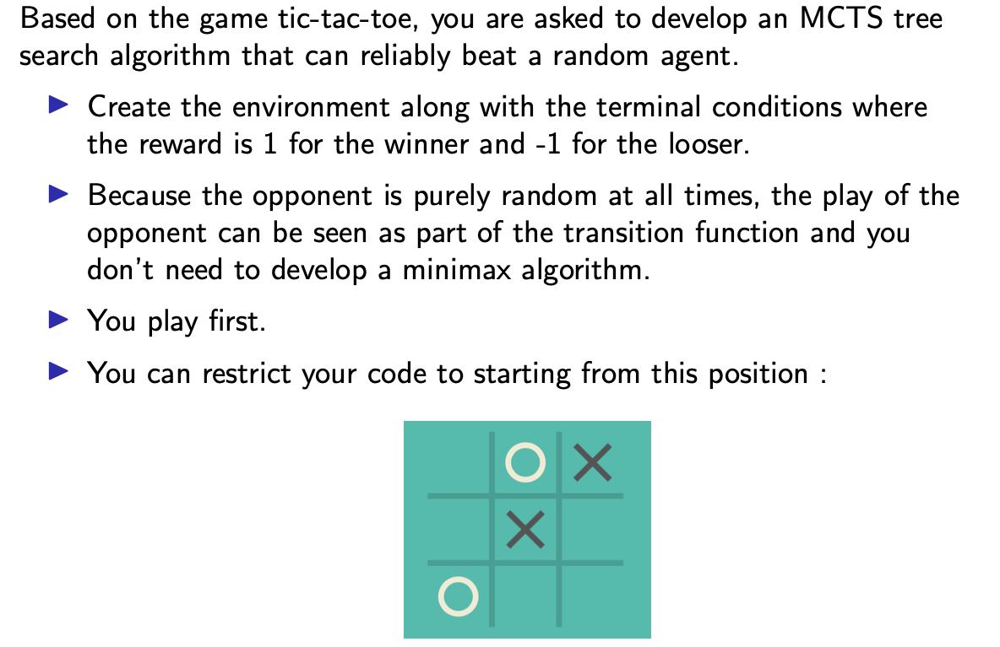
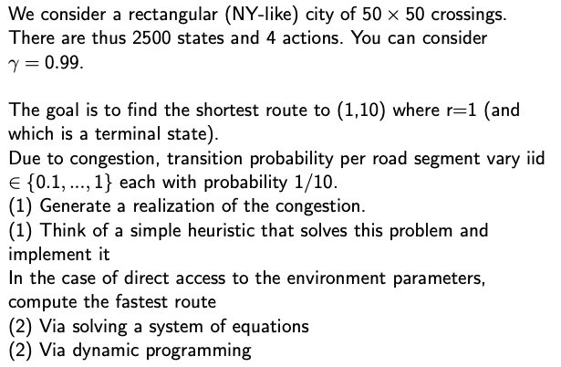
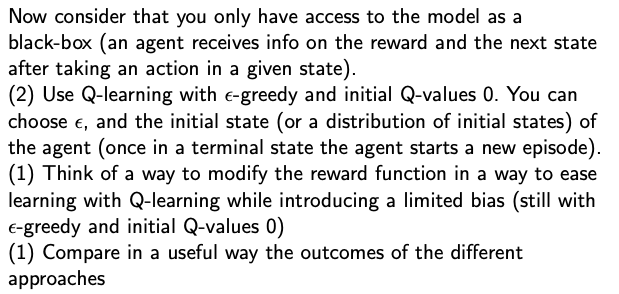

# Dynamic Programming and Reinforcement Learning (DPRL)

This repository showcases the implementation procedure and solutions to the four assignments in 2020 DPRL at Vrije Universiteit Amsterdam.

## Description of Assigments
[1. Airline Revenue Management](#1-airline-revenue-management)

[2. Deteriorating System Problem](#2-deteriorating-system-problem)

[3. Tic Tac Toe game - Monte Carlo Tree Search](#3-tic-tac-toe-game---monte-carlo-tree-search)

[4. Grid World - Q Learning](#4-grid-world---q-learning)

## 1. Airline Revenue Management

    

## 2. Deteriorating System Problem

    

## 3. Tic Tac Toe game - Monte Carlo Tree Search

    

## 4. Grid World - Q Learning

    

    

